# SalesMap 시스템 분석 통합본 (Class · UseCase · Sequence)

> 본 문서는 세 모델(Claude / Codex / Gemini)이 각각 작성한 분석
> (`system-analysis_claude.md`, `system_analysis_codex.md`, `system_analysis_gemini.md`)을
> 코드 실측 기준으로 **교차 검증·통합**한 결과다. 다이어그램·표·해설은 중복을 제거하고,
> 셋 중 가장 정확하거나 풍부한 표현을 채택했으며 부족한 부분은 합쳤다.
> 원본 코드는 어떠한 형태로도 수정하지 않았다.

---

## 목차

1. [프로젝트 개요](#1-프로젝트-개요)
2. [전체 아키텍처](#2-전체-아키텍처)
3. [디렉토리·모듈 구조](#3-디렉토리모듈-구조)
4. [유스케이스 다이어그램](#4-유스케이스-다이어그램)
5. [클래스 다이어그램](#5-클래스-다이어그램)
6. [시퀀스 다이어그램](#6-시퀀스-다이어그램)
7. [데이터 모델 (ERD)](#7-데이터-모델-erd)
8. [적용된 디자인 패턴](#8-적용된-디자인-패턴)
9. [API 요약](#9-api-요약)
10. [주요 알고리즘 & 운영 노트](#10-주요-알고리즘--운영-노트)
11. [예외/실패 처리 정책](#11-예외실패-처리-정책)
12. [보안·관측](#12-보안관측)
13. [보조 스크립트·인프라](#13-보조-스크립트인프라)
14. [확장 관점](#14-확장-관점)
15. [분석 결론](#15-분석-결론)

---

## 1. 프로젝트 개요

SalesMap은 서울시 25개 자치구의 분기별 추정매출(서울 열린데이터 광장 **OA-15572**)을
수집·저장·예측하여 지도 위에서 시각화하는 3-서비스(MSA-스타일) 시스템이다. 사용자는
프론트엔드에서 자치구·업종을 선택하고, 백엔드는 PostgreSQL에 저장된 최신 매출 및
AI가 만든 다음-분기 예측을 합쳐 응답한다. 수집·예측은 n8n이 백엔드 수집 API → AI 예측 API
를 순차로 호출하는 배치로 수행된다.

**분석 단위**

| 축 | 값 |
| --- | --- |
| 지역 | 서울 25개 자치구 |
| 업종 | `food` / `service` / `retail` |
| 시간 | `YYYYQn` 형식의 분기 |
| 매출 저장 단위 | `region_id × quarter × industry_category` |
| 예측 단위 | `region_id × industry_category × target_quarter` (이력 누적) |

**서비스 매핑**

| 서비스 | 진입점 | 주 책임 | 외부 의존 |
|--------|--------|---------|----------|
| `backend` | `backend/app/main.py` (FastAPI :8000) | 조회 API + 수집 API | PostgreSQL, OA-15572 |
| `ai` | `ai/app/main.py` (FastAPI :8001) | 셀별 선형회귀 예측 생성 | PostgreSQL, scikit-learn |
| `frontend` | `frontend/src/main.tsx` (Vite/React) | SVG 지도, 팝업, 차트 | backend REST |
| `infra` | `infra/docker-compose.yml` | PostgreSQL + n8n 컨테이너 | — |

---

## 2. 전체 아키텍처

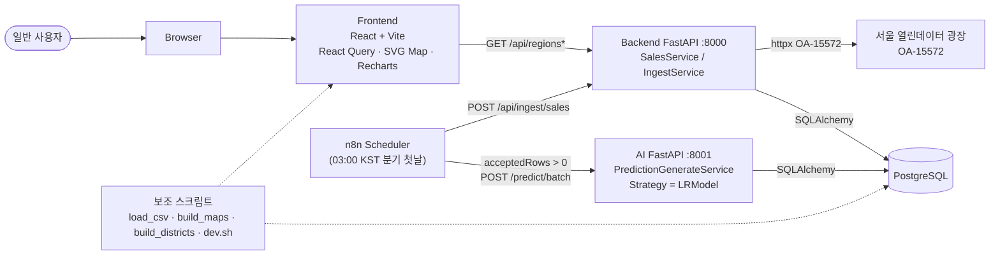

n8n 워크플로우는 `infra/n8n/workflows/quarterly-ingest-and-predict.json`에서
분기 첫날 03:00 KST에 수집 → `acceptedRows > 0` 분기일 때만 예측을 트리거한다.

### 컴포넌트/배포 뷰

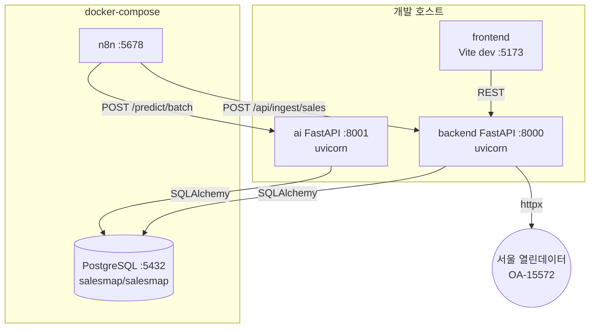

---

## 3. 디렉토리·모듈 구조

```
backend/app/
├── main.py                     # FastAPI + RequestIdMiddleware
├── db.py                       # SQLAlchemy engine / SessionLocal
├── models.py                   # Region, RegionDongMap, RegionTrdarMap, SalesRecord, PredictionRecord
├── schemas.py                  # Pydantic _Out(camelCase) DTO
├── core/{config,logging,security}.py
├── api/{regions,sales,ingest,deps}.py
├── repositories/{sales,prediction}.py
└── services/
    ├── sales.py                # SalesService (조회 유스케이스)
    └── ingest/
        ├── service.py          # SalesIngestService (Facade)
        ├── client.py           # OpenApiClient
        ├── adapter.py          # OpenApiRowAdapter, NormalizedRow, AdaptError
        ├── industry_map.py     # IndustryMap (CSV 매핑)
        └── region_resolver.py  # RegionResolver

ai/app/
├── main.py
├── db.py · models.py · schemas.py · quarter.py
├── core/{config,logging,security}.py
├── api/predict.py
├── services/predict.py         # PredictionGenerateService + 전처리
├── repositories/{sales,prediction}.py
└── predictor/
    ├── base.py                 # PredictorBase (Strategy abstract)
    ├── lr.py                   # LRModel (sklearn LinearRegression)
    └── factory.py              # create_predictor (_REGISTRY)

frontend/src/
├── main.tsx                    # QueryClientProvider 부트
├── App.tsx                     # 상태(industry, selectedRegionId) 보관
├── api/{client,regions,sales}.ts
├── hooks/{useRegions,useRegionSales,useSalesHistory}.ts
├── components/{MapView,RegionPopup,SalesSummary,SalesHistoryChart,IndustryToggle}.tsx
└── assets/seoul-districts.json # SVG path (build_districts.py 생성물)

infra/
├── docker-compose.yml          # PostgreSQL + n8n
├── db/{init.sql, industry_map.csv, 02-seed-trdar-map.sql, ...}
└── n8n/workflows/quarterly-ingest-and-predict.json
```

---

## 4. 유스케이스 다이어그램

라우터를 코드에서 직접 도출했다. Mermaid는 UML `usecaseDiagram`을 안정적으로 지원하지 않아
`graph LR` 로 그렸다.

```mermaid
graph LR
    classDef actor fill:#fff,stroke:#333,stroke-width:1px,color:#000;

    User((사용자<br/>브라우저)):::actor
    N8N((n8n<br/>스케줄러)):::actor
    OPEN((서울 열린데이터<br/>OA-15572)):::actor
    Dev((개발자/운영자)):::actor
    DB[(PostgreSQL)]

    subgraph Backend[Backend FastAPI :8000]
        UC1([UC1: 자치구 목록 조회<br/>GET /api/regions])
        UC2([UC2: 자치구·업종 매출/예측 조회<br/>GET /api/regions/{id}/sales])
        UC3([UC3: 분기 추이 조회<br/>GET /api/regions/{id}/sales/history])
        UC4([UC4: 매출 데이터 수집<br/>POST /api/ingest/sales])
        UC5([UC5: Health Check<br/>GET /healthz])
    end

    subgraph AISvc[AI FastAPI :8001]
        UC6([UC6: 단일 셀 예측<br/>POST /predict/{region_id}])
        UC7([UC7: 배치 예측 생성<br/>POST /predict/batch])
        UC8([UC8: Health Check<br/>GET /healthz])
    end

    subgraph Scripts[보조 스크립트]
        UC10([UC10: CSV 샘플 적재<br/>load_csv.py])
        UC11([UC11: 업종/상권 매핑 생성<br/>build_maps.py])
        UC12([UC12: 지도 에셋 생성<br/>build_districts.py])
    end

    User --> UC1
    User --> UC2
    User --> UC3

    N8N --> UC4
    N8N --> UC7
    N8N -.-> UC5
    N8N -.-> UC8

    Dev --> UC10
    Dev --> UC11
    Dev --> UC12

    UC4 -.->|fetch_quarter| OPEN
    UC4 -.->|upsert| DB
    UC1 -.-> DB
    UC2 -.-> DB
    UC3 -.-> DB
    UC6 -.-> DB
    UC7 -.-> DB
    UC10 -.->|동일 Adapter 경로 재사용| UC4

    UC4 -. include .-> UC9([인증: X-Internal-Token])
    UC6 -. include .-> UC9
    UC7 -. include .-> UC9
```

**시나리오 요약**

| ID | 액터 | 시나리오 | 사전조건 | 사후조건 |
|----|------|----------|----------|----------|
| UC1 | 사용자 | 지도에서 25개 자치구 메타 로딩 | — | regions 캐시 채움 |
| UC2 | 사용자 | 구·업종 선택 시 최신 분기/예측 표시 | UC1 완료, 데이터 존재 | 팝업 갱신 |
| UC3 | 사용자 | 팝업의 분기별 추이 라인차트 표시 | UC1 완료 | 차트 갱신 |
| UC4 | n8n | OA-15572 수집·정규화·upsert | OPEN_API_KEY, INTERNAL_TOKEN | sales_record 증분 |
| UC6 | n8n / 운영자 | 특정 셀만 재예측 | sales_record ≥ 2분기 | prediction_record 추가 |
| UC7 | n8n | 25 × 3 = 75 셀 일괄 재예측 | UC4 직후 권장 | prediction_record 75건(성공분) |
| UC9 | — | X-Internal-Token 검증 (include) | settings.internal_token 일치 | 통과/401 |
| UC10–12 | 개발자 | CSV 적재·매핑/지도 에셋 생성 | 원본 데이터 보유 | DB seed / 프론트 에셋 갱신 |

---

## 5. 클래스 다이어그램

가독성을 위해 5개 서브 다이어그램으로 분리한다. 모든 메서드 시그니처는 실제 코드와 1:1 매칭.

### 5-1. Backend 도메인·서비스·리포지토리

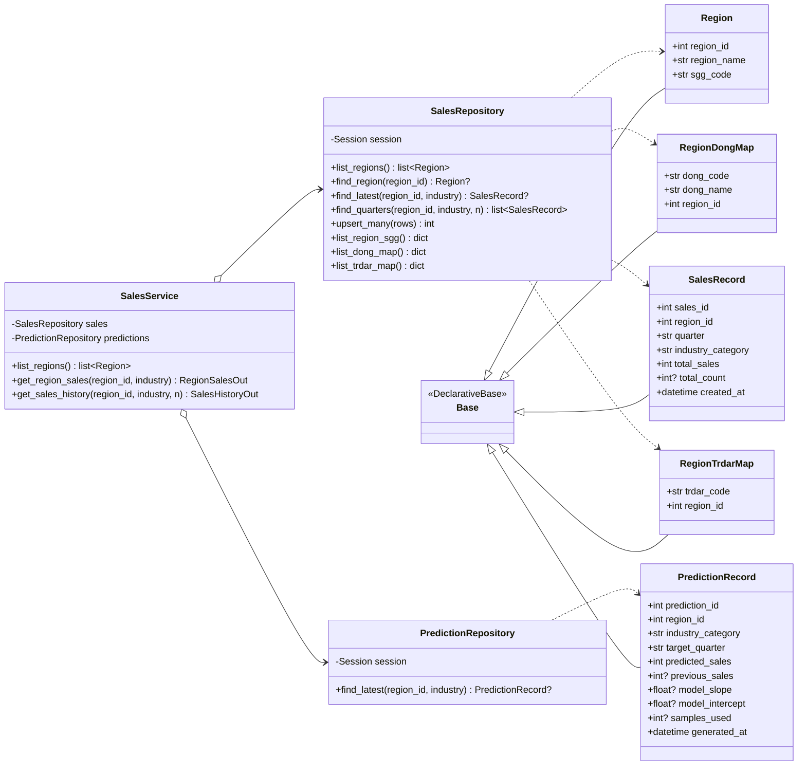

### 5-2. Backend Ingest 서브시스템 (Facade · Adapter)

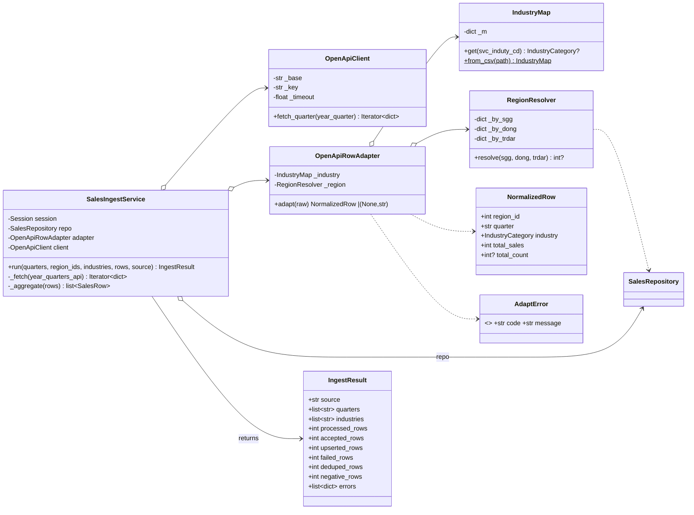

### 5-3. AI 서비스 — Strategy + Factory

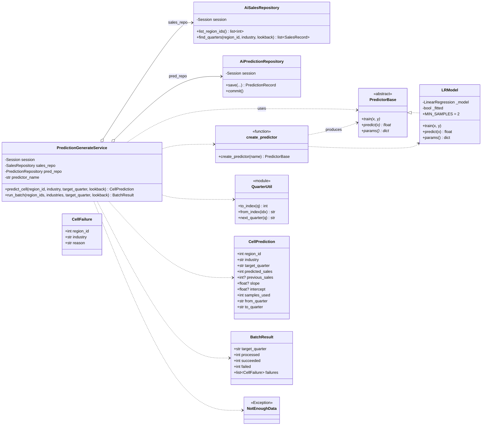

### 5-4. Frontend 컴포넌트·훅·모듈

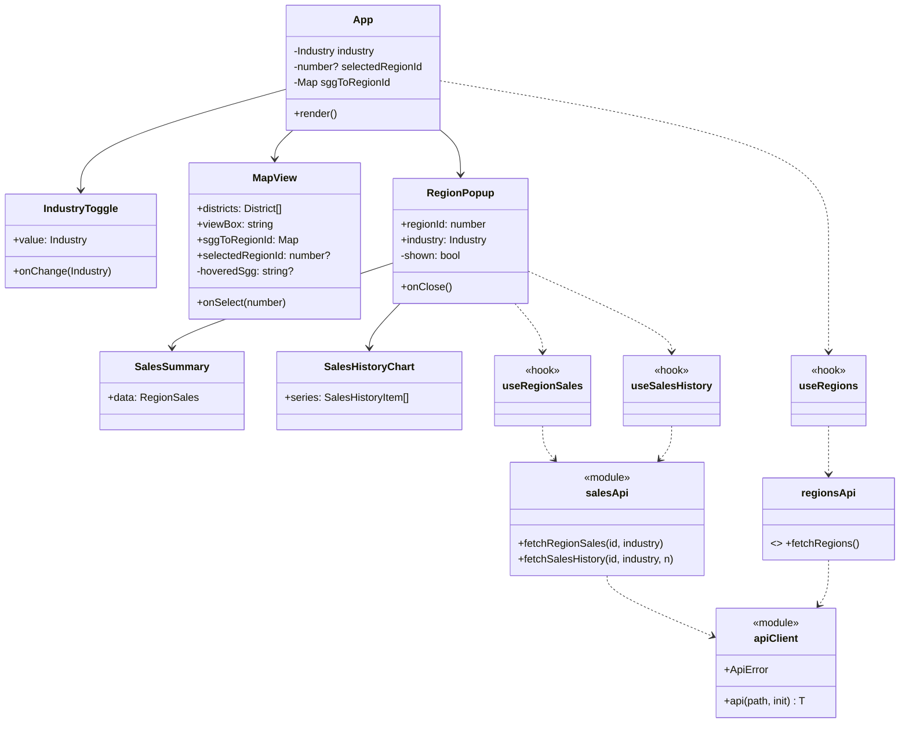

### 5-5. 라우터·미들웨어 (FastAPI 진입점)

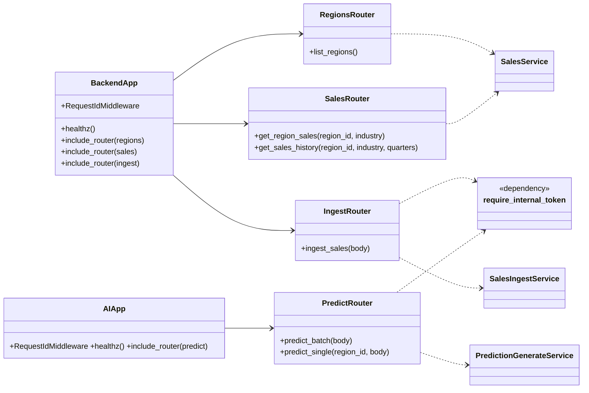

---

## 6. 시퀀스 다이어그램

### 6-1. UC2 — 자치구·업종 매출/예측 조회 (frontend → backend → DB)

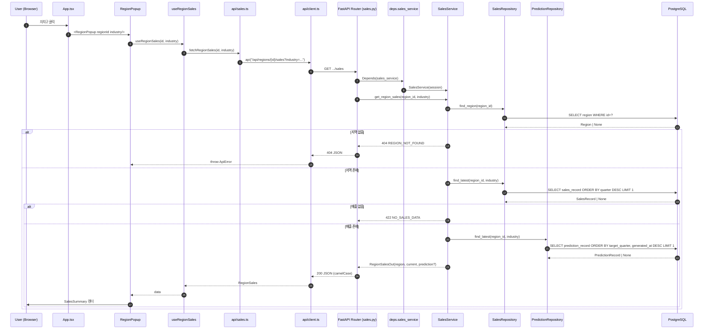

### 6-2. UC3 — 분기 추이 조회 (병렬 호출의 다른 한 축)

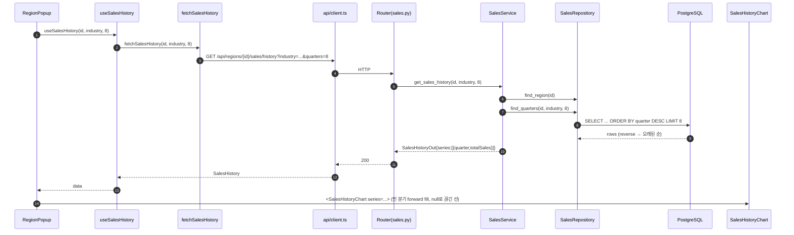

### 6-3. UC4 — 매출 데이터 수집 (Facade 파이프라인)

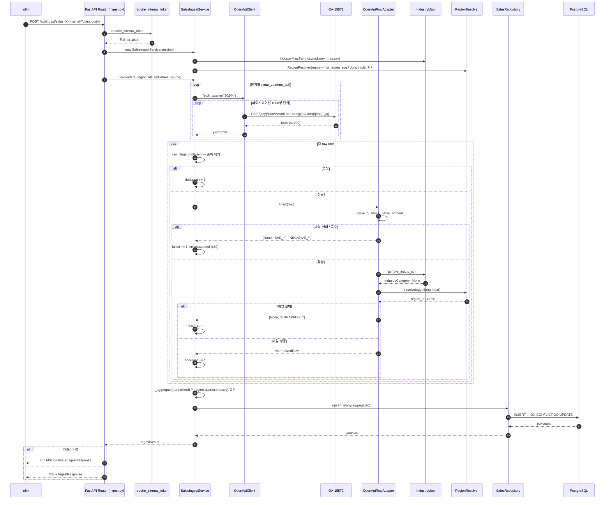

### 6-4. UC7 — 배치 예측 (AI Strategy + Factory)

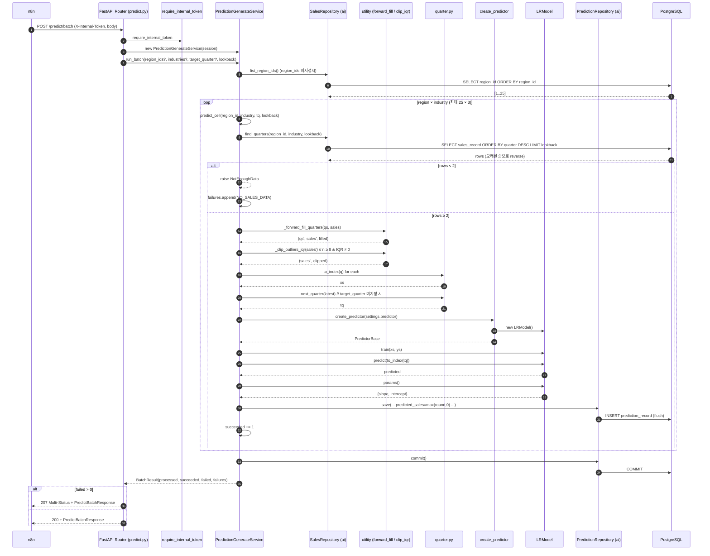

### 6-5. UC6 — 단일 셀 예측

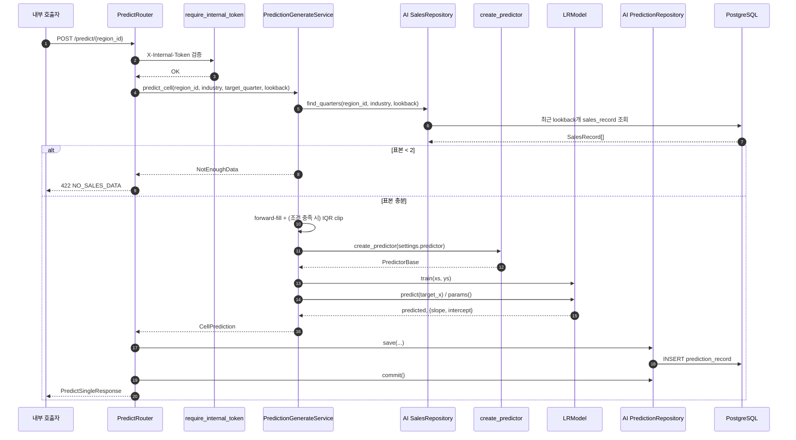

### 6-6. n8n 배치 워크플로우 (수집 → 조건부 예측)

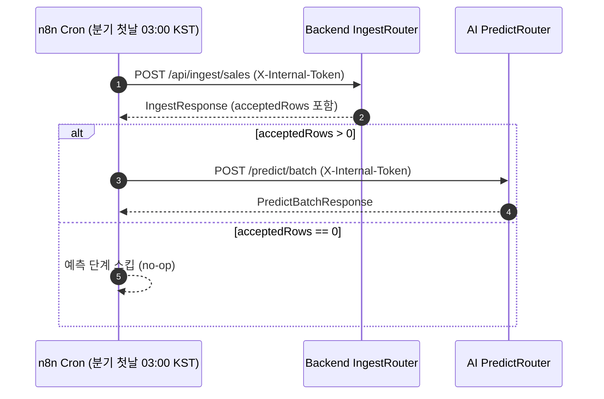

---

## 7. 데이터 모델 (ERD)

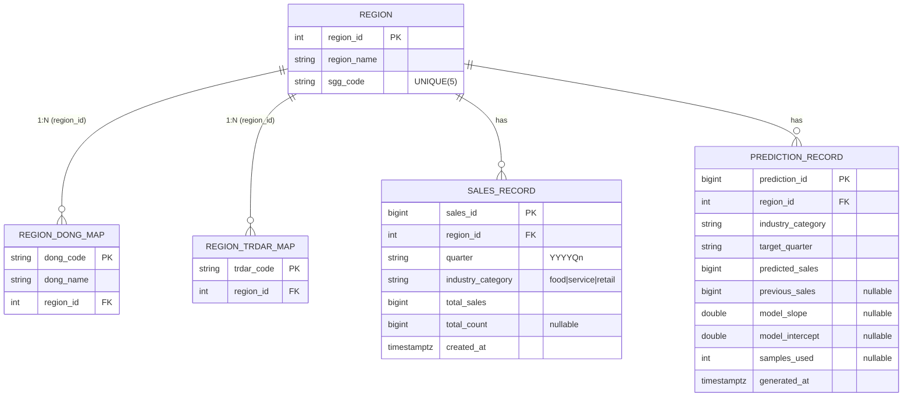

- `sales_record` 는 `(region_id, quarter, industry_category)` `UniqueConstraint` 로 멱등 upsert 보장.
- `prediction_record` 는 unique 제약 없이 누적되며, 조회는 `target_quarter DESC, generated_at DESC LIMIT 1` 로 최신만 노출.
- backend / ai 양쪽이 동일 스키마(`models.py`)를 **중복 정의**하여 공유한다 — MVP 정책(docs/04 참고).

---

## 8. 적용된 디자인 패턴

`docs/10-design-patterns.md` 가 의도를 적었다면, 본 절은 실제 어떤 파일/클래스가 어떤 역할로
패턴을 충족하는지를 코드 기준으로 못박는다.

| 패턴 | 역할 | 구현 위치 | 근거 / OCP 영향 |
|------|------|-----------|----------------|
| **Layered Architecture** | 관심사 분리 | `api → services → repositories → models` | 라우터는 얇고 도메인은 service, 영속성은 repository |
| **Repository** | 영속성 추상화 | `backend/app/repositories/*.py`, `ai/app/repositories/*.py` | 서비스가 ORM 세션을 직접 다루지 않음 |
| **Service Layer** | 유스케이스 캡슐화 | `SalesService`, `PredictionGenerateService` | 라우터 한 줄 위임 |
| **Facade** | 다단계 수집 흐름 단일 진입 | `SalesIngestService.run` | fetch → adapt → aggregate → upsert 를 한 호출로 묶음 |
| **Adapter** | 외부 표현 ↔ 내부 모델 | `OpenApiRowAdapter` (+ `IndustryMap`, `RegionResolver`) | OA-15572 컬럼 fallback 튜플 → `NormalizedRow` 변환. 외부 컬럼 변경 시 매핑만 수정 |
| **Strategy** | 예측 알고리즘 교체 | `PredictorBase` ↔ `LRModel` | OCP: `PolyModel`/`ArimaModel` 추가 시 서비스 코드 무변경 |
| **Factory Method (Simple Factory)** | 전략 객체 생성 | `create_predictor`, `_REGISTRY` | 설정 문자열(`PREDICTOR=lr`)만으로 클래스 교체 |
| **DTO + Alias Generator** | snake↔camel 경계 변환 | `backend/app/schemas.py:_Out`, `ai/app/schemas.py:_Camel` | `alias_generator=_to_camel, populate_by_name, from_attributes` |
| **Dependency Injection** | 세션/서비스 주입 | `backend/app/api/deps.py`, `ai/app/api/predict.py:db_session` | FastAPI `Depends` |
| **Middleware (Decorator 변형)** | 요청 ID/로그 컨텍스트 | `RequestIdMiddleware` (양 서비스) | structlog `contextvars` 바인딩 |
| **Iterator/Generator** | 페이지네이션 + 메모리 절약 | `OpenApiClient.fetch_quarter`, `_fetch` | `yield from` 으로 lazy 스트리밍 |
| **Idempotent Batch** | 재실행 안전성 | `upsert_many` + `_raw_fingerprint` | `ON CONFLICT DO UPDATE` + 동일 페이로드 한 번 더 거름 |

---

## 9. API 요약

| 서비스 | 메서드/경로 | 용도 | 인증 |
| --- | --- | --- | --- |
| Backend | `GET /healthz` | 헬스 체크 | 없음 |
| Backend | `GET /api/regions` | 자치구 목록 | 없음 |
| Backend | `GET /api/regions/{region_id}/sales` | 최신 매출 + 최신 예측 | 없음 |
| Backend | `GET /api/regions/{region_id}/sales/history` | 최근 분기 매출 추이 | 없음 |
| Backend | `POST /api/ingest/sales` | 외부 매출 수집/집계/upsert | `X-Internal-Token` |
| AI | `GET /healthz` | 헬스 체크 | 없음 |
| AI | `POST /predict/batch` | 전체/지정 셀 배치 예측 | `X-Internal-Token` |
| AI | `POST /predict/{region_id}` | 단일 지역/업종 예측 | `X-Internal-Token` |

응답 형식: 모두 camelCase JSON (Pydantic `_Out`/`_Camel` 의 `alias_generator`).

---

## 10. 주요 알고리즘 & 운영 노트

### 10-1. 분기 인덱스 (ai/app/quarter.py)
회귀의 x축으로 사용할 수 있도록 `YYYYQn → year*4 + (n-1)` 단조 증가 정수로 변환.
분기 간격이 1로 보장되어 LR이 동일 스케일에서 동작.

### 10-2. 시계열 전처리 (`ai/app/services/predict.py`)
1. `_forward_fill_quarters` — 누락 분기를 직전 값으로 채워 연속 시계열 생성
2. `_clip_outliers_iqr` — 표본 ≥ 8 & IQR ≠ 0 일 때만 `[Q1−1.5·IQR, Q3+1.5·IQR]` 로 clip
3. 학습 직전 `log.info("preprocess_applied", ...)` 로 채워진/clip된 개수를 관측 가능 형태로 남김

선형회귀는 표본이 매우 적기 때문에 outlier 한 점이 기울기를 크게 흔드는데, IQR clip이 이를 완화한다.

### 10-3. 수집 멱등성
- `SalesRepository.upsert_many` — PostgreSQL 전용 `INSERT ... ON CONFLICT (region_id, quarter, industry_category) DO UPDATE`
- `SalesIngestService.run` — 행 단위 `_raw_fingerprint` 로 같은 페이로드 중복 한 번 더 거름
- 분기 표현 양방향 변환: API용 `20244` ↔ 내부 `2024Q4` (`_to_api_quarter` / `_parse_quarter`)

### 10-4. 프론트엔드 추이 차트
`SalesHistoryChart.tsx` 가 응답 시계열을 분기 순 정렬 후, 중간에 빠진 분기는
`totalSales: null` 로 채워 Recharts에서 **선을 끊어** 데이터 부재를 시각적으로 드러냄 (`connectNulls={false}`).

---

## 11. 예외/실패 처리 정책

| 상황 | 응답/처리 | 코드 위치 |
|------|----------|----------|
| 지역 없음 (조회) | `404 REGION_NOT_FOUND` | `SalesService.get_region_sales` |
| 매출 없음 (조회) | `422 NO_SALES_DATA` | 동상 |
| 외부 API 실패 (수집) | `502 UPSTREAM_API_ERROR` | `ingest.py` 라우터 |
| 행 단위 수집 실패 | 207, `errors[]` 최대 50건 | `SalesIngestService.run` |
| 셀 단위 예측 실패 | 207, `failures[]` 누적 | `run_batch` try/except |
| 표본 부족 (단일 예측) | `422 NO_SALES_DATA` (`NotEnoughData`) | `predict_cell` |
| 잘못된 토큰 | `401 UNAUTHORIZED` | `core/security.py` |

배치는 한 셀이 실패해도 나머지를 계속 진행 — **부분 실패 격리** 원칙.

---

## 12. 보안·관측

- **인증** — `core/security.py:require_internal_token` 가 `X-Internal-Token` 헤더를 `settings.internal_token` 과 정확 일치 비교 (HMAC/만료 없음, MVP 한정).
- **CORS** — `backend/app/main.py` 가 `CORS_ORIGINS` (콤마 분리) 파싱. AI 서비스는 외부 노출 안 함 (CORS 미설정).
- **요청 추적** — `RequestIdMiddleware` 가 `X-Request-Id` 헤더 수용/발급, structlog `contextvars` 에 `request_id`, `n8n_execution_id`, `service` 바인딩 후 모든 로그가 JSON으로 그 컨텍스트 포함.
- **로그 파일** — `backend/app.log` 로 FileHandler 출력 (외부 에이전트가 읽도록).
- **민감정보 마스킹** — `OpenApiClient.fetch_quarter` 가 URL 로깅 시 key 마스킹(`abcd****`).

---

## 13. 보조 스크립트·인프라

| 파일 | 역할 |
| --- | --- |
| `backend/scripts/load_csv.py` | CSV → `SalesIngestService.run(rows=...)` 로 동일 Adapter/Aggregate/Upsert 경로 재사용 |
| `backend/scripts/build_maps.py` | OA-15560/OA-15572 호출로 `industry_map.csv`, `02-seed-trdar-map.sql` 재생성 |
| `frontend/scripts/build_districts.py` | 서울 TopoJSON → SVG path 기반 `seoul-districts.json` 변환, 공유 arc 곡선화로 경계 틈 감소 |
| `dev.sh` | backend/ai/frontend 개발 서버 동시 실행 + `.dev-logs/`에 로그 분리. 옵션으로 infra docker-compose 함께 실행 |
| `infra/docker-compose.yml` | PostgreSQL + n8n 만 컨테이너화. backend/ai/frontend는 로컬 dev 서버 |
| `infra/db/init.sql`, `02-seed-trdar-map.sql`, `industry_map.csv` | 스키마 초기화 + 자치구/업종 seed |
| `infra/n8n/workflows/quarterly-ingest-and-predict.json` | 분기 첫날 03:00 KST 수집 → `acceptedRows > 0` 일 때만 배치 예측 호출 |

---

## 14. 확장 관점

- **예측 모델 확장** — `_REGISTRY` 에 새 `PredictorBase` 구현(`PolyModel`, `ArimaModel` 등)을 등록하면 호출부 무변경. (Strategy + Factory 의 OCP 직접 활용)
- **외부 데이터 형식 변경 대응** — `OpenApiRowAdapter` 의 컬럼 후보 튜플(`_COL_*`)과 파싱 함수만 갱신하면 수집 파이프라인의 나머지 단계는 유지.
- **지도 에셋 재생성** — `build_districts.py` 가 `sggCode` 를 DB seed 와 맞추므로, 프론트 전용 에셋이지만 백엔드 `region_id` 와 연결성 유지.
- **운영 배치 안정성** — 수집은 upsert, 예측은 이력 누적이므로 실패 후 재실행이 비교적 안전.
- **인증 강화** — 현재 단순 토큰 동등 비교. 운영 단계에서는 HMAC + 만료 + 키 회전 도입 후보.
- **다중 인스턴스 / 캐시** — `RegionResolver` 가 인스턴스 생성 시 DB를 풀스캔해 메모리에 캐싱. 인스턴스 수명을 늘리거나 외부 캐시(Redis)로 분리하면 호출당 비용 감소.

---

## 15. 분석 결론

SalesMap은 **frontend / backend / ai / db / n8n** 이 책임별로 명확히 분리된 구조다.

- **사용자 조회 흐름**은 빠른 읽기 API 중심 (FastAPI + Pydantic camelCase DTO + React Query).
- **데이터 수집·예측 흐름**은 내부 토큰으로 보호된 배치 API 중심 (Facade로 다단계 파이프라인을 단일 진입점에 묶음).
- **AI 예측 알고리즘**은 Strategy + Factory 로 분리되어 다른 모델로 교체 시 비즈니스 로직 변경이 필요 없음.
- **데이터 일관성**은 `sales_record` Unique constraint + `ON CONFLICT DO UPDATE` 로 멱등성을 보장하고, `prediction_record` 는 이력 누적으로 추적성을 확보.
- **관측·격리**는 RequestIdMiddleware + 207 Multi-Status + per-cell try/except 로 부분 실패를 안전하게 외부에 전달.

본 통합본은 세 분석(Claude/Codex/Gemini)의 사실관계를 코드 정독으로 교차 검증했으며, 다이어그램 표현·주요 클래스 시그니처·시퀀스 호출 순서는 모두 실제 구현과 일치한다.

---

### 부록: 분석 소스

- **본 통합본의 1차 자료**: `backend/app/**/*.py`, `ai/app/**/*.py`, `frontend/src/**/*.{ts,tsx}`, `infra/docker-compose.yml`, `infra/db/*`, `infra/n8n/workflows/*.json`, 보조 스크립트
- **참고한 선행 분석 문서**:
  - `docs/system-analysis_claude.md` (구조·시퀀스·알고리즘·보안 노트)
  - `docs/system_analysis_codex.md` (보조 스크립트·n8n·확장 관점·API 표)
  - `docs/system_analysis_gemini.md` (Strategy/Factory OCP·시나리오 압축)
- 기존 `docs/01-overview.md ~ 12-observability.md` 는 교차 검증용으로만 활용.

원본 코드는 어떠한 형태로도 수정하지 않았다.
